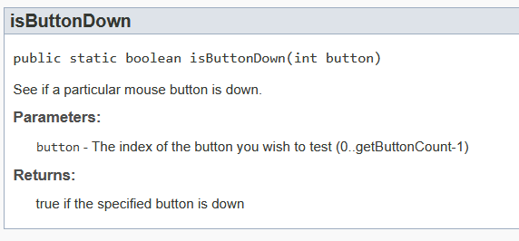
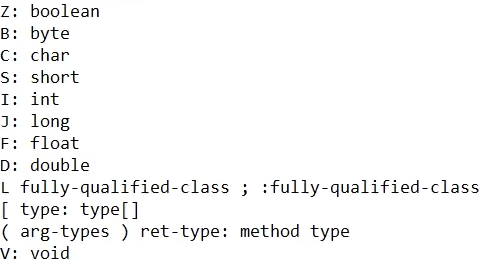

### Segundo passo

Para o segundo passo, eh importante falar sobre o novo software a ser utilizado: JADX.
O JADX � um decompilador de `.jar` que sera usado para procurar metodos usados no minecraft para procurar por metodos dentro do Java.
O JADX pode ser encontrado no [link](https://github.com/skylot/jadx). Procure da coluna da direita do site por 'Releases' e clique na versao apontada. Depois, instale o `jadx-gui-VERSAO-win.zip`.

#### Por que decompilar?

A decompilacao eh necessaria para encontrar com clareza quais as classes do Java estao sendo utilizadas para chamar/interpretar as teclas pressionadas. Isto eh, entender quais as funcoes dentro do Minecraft devem ser chamadas para executar o que nos eh desejado.

#### Setup JADX

Primeiramente, eh necessario que no seu computador pelo menos uma versao do Minecraft ja tenha sido jogada/aberta. Feito isso, execute o `.jar` do JADX:
- Com o software aberto, procure no seu `Win+R` '%appdata%', para achar a localizacao da pasta do `.minecraft`
- Clique na `.minecraft`, em seguida `versions` e na pasta da versao desejada para fazer a DLL. Na pasta da versao, arraste o `.jar` encontrado para o JADX
- Agora voce tera acesso ao codigo Java decompilado da versao
- Vale ressaltar que todos os arquivos estao ofuscados, tornando mutio dificil a leitura do codigo

#### Achando metodos

Para achar metodos uteis para a DLL, na aba superior, em Navigation > Text Search, procura-se, por exemplo, o termo "Mouse", afim de achar a classe que chama o input do Mouse. Via de regra os inputs sao interpretados pela API `org.lwjgl.glfw`.
No caso da versao `1.9.4`, usada nesse projeto, depois de analisar os imports de "Mouse", encontrou-se: 

```java
import org.lwjgl.input.Mouse;
```

E, olhando o [Javadoc da API](https://legacy.lwjgl.org/javadoc/org/lwjgl/input/Mouse.html), achou-se algumas funcoes do tipo `isButtonDown(int button)` nos metodos da API:



Essa funcao interpreta o estado do botao do mouse selecionado, logo, ela sera usada como teste para a DLL.


#### Codigo

Em relacao ao codigo, temos a seguinte modificacao da funcao `MainThread`:

```cpp
void MainThread(HMODULE module) {

	JavaVM* p_jvm{ nullptr };
	jint result = JNI_GetCreatedJavaVMs(&p_jvm, 1, nullptr);

	JNIEnv* p_env{ nullptr };
	p_jvm->AttachCurrentThread((void**)&p_env, nullptr);

	jclass mouse_class{ p_env->FindClass("org/lwjgl/input/Mouse") };

	if (mouse_class == 0){
		printf("Failed to get Mouse class\n");
		MessageBoxA(0, "ERROR", "Check console", MB_ICONERROR);
		FreeLibrary(module);
	}

	jmethodID is_button_down_id{ p_env->GetStaticMethodID(mouse_class, "isButtonDown", "(I)Z") };
	if (is_button_down_id == 0) {
		printf("Erro ao capturar o metodo de input do Mouse");
		MessageBoxA(0, "ERRO", "Verifique o Console", MB_ICONERROR);
		FreeLibrary(module);
	}

	while (!GetAsyncKeyState(VK_END)) {
		static jint arg{ 0 }; 

		if (p_env->CallStaticBooleanMethodA(mouse_class, is_button_down_id, (jvalue*)&arg))
		{
			printf("Mouse clicado!\n");
		}
	}
	FreeLibrary(module);
}
```
Em linhas gerais, as mudancas do codigo consistem em:

- `JNIEnv* p_env{ nullptr };`, que muda o tipo do ponteiro de ambiente para captar as mudancas na JVM executada
- `p_jvm->AttachCurrentThread((void**)&p_env, nullptr);`, que aloca o `p_env` para a thread atual da JVM
- `jclass mouse_class{ p_env->FindClass("org/lwjgl/input/Mouse") };`, que instancia uma classe Java no C++, procurando no ambiente (`p_env`) pela classe achada anteriormente e que desejava-se usar (`org.lwjgl.input.Mouse`, trocando os `.` por `/`)
	- O bloco de `if (mouse_class == 0)` eh um indicativo se houve exito ao procurar a classe
- `jmethodID is_button_down_id{ p_env->GetStaticMethodID(mouse_class, "isButtonDown", "(I)Z") };`, instancia de um metodo Java estatico (pois eh estatico na documentacao)
	- Os argumentos de `GetStaticMethod` sao: (_NOME DA CLASSE_, _NOME DO METODO DESEJADO_, _TIPO DE ARGUMENTO/RETORNO_)
	- Sobre o tipo de argumento/retorno, segue-se a seguinte regra (ARG)RET:
	
	

	- No caso, o retorno eh `boolean` e o argumento eh `int`, logo `(I)Z` no `jmethodID`. Contudo, se fossem argumentos como `int a, double x`, seriam uma situacao do tipo `(ID)Z`

Agora, no loop de execucao:

```cpp
		static jint arg{ 0 }; 

		if (p_env->CallStaticBooleanMethodA(mouse_class, is_button_down_id, (jvalue*)&arg))
		{
			printf("Mouse clicado!\n");
		}
```

- `static jint arg{ 0 };`, inicia uma variavel na JVM para usar de argumento (`0` significa o botao do Mouse 1 (esquerdo))
- `p_env->CallStaticBooleanMethodA(mouse_class, is_button_down_id, (jvalue*)&arg)`, chama o metodo de verificar o pressionamento do Mouse e printar no terminal uma string

Agora com o codigo se eh capaz de executar metodos arbitrarios na DLL atraves de classes chamadas pela JVM do arquivo executado.