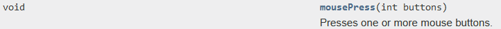

### Terceiro Passo

Agora, com os conceitos basicos do cheat a ser feito, pensa-se no que sera feito para a execucao. Para a continuidade do projeto, serao excluidos os metodos achados anteriormente do Java usado no Minecraft para que sejam usados Hooks no codigo. De acordo com o ChatGPT:

#### Hooks

Um **hook** é um conceito em desenvolvimento de software que se refere a um ponto de extensão ou "gancho" em um fluxo de execução de código. Ele permite que desenvolvedores adicionem, modifiquem ou substituam funcionalidades em sistemas existentes sem alterar diretamente o código-fonte principal. Hooks são amplamente usados em sistemas modulares, frameworks e bibliotecas, como em WordPress, Laravel ou React.

- **Em sistemas operacionais ou APIs**: Um hook pode interceptar chamadas, mensagens ou eventos antes de serem processados pelo código original.
- **Em frameworks e CMS**: Um hook pode ser usado para executar código personalizado em momentos específicos, como antes de salvar dados no banco ou ao carregar uma página.
  
- Tipos de Hooks:
    1. **Action Hooks**: Executam uma ação adicional em um ponto específico do código.
    2. **Filter Hooks**: Modificam dados antes que sejam utilizados.


**MinHook** é uma biblioteca de código aberto escrita em C/C++ que permite a criação de hooks no nível de API ou funções específicas em sistemas Windows. Ele é comumente utilizado para interceptar chamadas de função em aplicativos, podendo ser usado para depuração, análise de comportamento ou personalização de programas.

#### Setup

##### MinHooks

Para essa parte, por fins praticos, sera utilziada a biblioteca do [MinHooks](https://github.com/TsudaKageyu/minhook), para realizar os Hooks de inputs de teclado/mouse no codigo. Para instala-la no projeto, primeiramente clica-se na versao de release mais recente (na aba direita do repositorio do github) e eh feito o donwload do arquivo "MinHook_VERSAO_lib.zip". Ao extrair o arquivo:

- Va para o diretorio `include`, onde estara o arquivo `MinHook.h`, copie-o e cole-o na pasta `Dependencies/Include`, criada no Primeiro Passo do seu projeto. 
- Va para o diretorio `lib`, onde voce procurara a versao mais recente de `libMinHook-x64-VERSAO-mt.lib`. Copie o arquivo e cole-o na pasta `Dependencies/Lib`, criada no Primeiro Passo do seu projeto. 
    - Ao fazer isso, va agora no Visual Studio e altere as propriedades do projeto. Em Additional Dependencies, que ja fora modificada no Primeiro Passo, coloque ao fim do que estava la `;libMinHook-x64-VERSAO-mt.lib`, adicionando a nova dependencia do MinHooks. Ao final deveria ficar assim: `$(CoreLibraryDependencies);%(AdditionalDependencies);jvm.lib;libMinHook-x64-VERSAO-mt.lib`

Ainda no Visual Studio, clique com o botao direito no projeto e adicione um novo filtro chamado `Dependencies` e, com outro clique com o botao direito em `Dependencies`, adicione outro novo filtro chamado `MinHook`. Agora, com mais um clique com o botao direito, adicione um item existente, que sera o arquivo `MinHook.h` que esta na pasta `Dependencies/Include`. Nao confunda essa pasta com o novo filtro.

Agora tudo esta pronto para o uso dos Hooks no codigo.

##### Novas Classes

Clique com o botao direito no projeto e crie duas novas classes: `JNI` e `Hooks`. Coloque os arquivos `JNI.cpp` e `JNI.h` dentro do mesmo filtro `JNI`, faça o mesmo para `Hooks.cpp` e `Hooks.h` para o filtro `Hooks`.

Essas serao as classes a serem usadas para inicializar e instanciar os procedimentos a serem usados dentro do JNI.

#### O Codigo Inicial

O codigo inicial foi modificado para atribuir os procedimentos de inicializacao para outras classes, tornando o projeto mais orientado a objetos. 
Serao criadas classes de inicilizacao dos ponteiros do JNI (p_env e p_jvm) e dos Hooks (que chamarao funcoes do java para serem executadas).

##### Main

A nova `main.cpp` inicialmente eh assim:

```cpp
#include <thread>
#include <cstdio>
#include <Windows.h>
#include <jni.h>
#include "JNI.h"
#include "Hooks.h"

void MainThread(HMODULE module) {

	p_jni = std::make_unique<JNI>();
	p_hooks = std::make_unique<Hooks>();

	while (!GetAsyncKeyState(VK_END)) {

	}
	FreeLibrary(module);
}

bool __stdcall DllMain(HINSTANCE instance, DWORD reason, LPVOID reserved) {

	static FILE* p_file{ nullptr };
	static std::thread main_thread;

	if(reason == DLL_PROCESS_ATTACH) {

		AllocConsole();
		freopen_s(&p_file, "CONOUT$", "w", stdout);
		main_thread = std::thread([instance] { MainThread(instance);});
		if (main_thread.joinable()) {
			main_thread.detach();
		}
	}
	else if (reason == DLL_PROCESS_DETACH) {

		fclose(p_file);
		FreeConsole();

	}
	
	return true;
}
```

Para a nova abordagem do codigo, os imports `#include "JNI.h"` e `#include "Hooks.h"` sao os imports das novas classes criadas. Elas sao chamadas por um construtor unificado (`p_jni = std::make_unique<JNI>();` e `p_hooks = std::make_unique<Hooks>();`):
- `std::make_unique` chama um construtor de uma classe instanciada por `std::unique_ptr`, que por sua vez eh um smart pointer do C++.
- `std::unique_ptr` instancia um objeto via smart pointer, alocando dinamicamente a memoria a ser utilizada quando o objeto eh criado e desalocando automaticamente a memoria quando o objeto sai do escopo (destruidor).

##### JNI.h

Para `JNI.h`, o codigo fica assim:

```cpp
#pragma once
#include <memory>
#include <Windows.h>
#include <jni.h>

class JNI final{

public:
	// Construtor
	JNI() {

		// Inicializando os ponteiros basicos
		{
			jint result = JNI_GetCreatedJavaVMs(&p_jvm, 1, nullptr);
			if (result != 0) {
				printf("[-] Falha ao inicializar ponteiro para JVM (p_jvm)");
				MessageBoxA(0, "ERROR", "Check Console", MB_ICONASTERISK);
			}

			p_jvm->AttachCurrentThread((void**)&p_env, nullptr);
		}

		// Inicializando classes do jogo
		{

		}
		
		is_init = true;

	}

	// Destruidor
	~JNI() {
		p_jvm->DetachCurrentThread();
		is_init = false;
	}

	bool GetInit() {
		return is_init;
	}

private:
	JavaVM* p_jvm;
	JNIEnv* p_env;

	bool is_init{ false };
};


inline std::unique_ptr<JNI> p_jni;

```

O funcionamento do codigo se da por:

- `class JNI final {...} inline std::unique_ptr<JNI> p_jni;`, que instancia uma classe JNI (que nao tem herancas, por isso eh final) e a sua instancia unica para todo o programa (inline) para o seu `unique_ptr`
- Na secao `public`:
    - O construtor `JNI()`, que realiza o procedimento de achar a JNI para o ponteiro do JVM, antes na main e o coloca em uma thread. Ao fazer isso ele seta a variavel local `is_init`, que indica se o JNI foi iniciado, para `true`
    - O destruidor `~JNI()`, que faz o `Dettach` da thread do JNI e seta a variavel local `is_init` para `false`
    - O metodo `GetInit()` que retorna se o JNI ja foi iniciado
- Na secao `private`:
    - As instancias dos ponteiros `JavaVM* p_jvm;` e `JNIEnv* p_env;`, usados no construtor, e do booleano `bool is_init{ false };`.

##### Hooks.h

Para `Hooks.h`, o codigo fica assim:

```cpp
#pragma once
#include <memory>
#include <MinHook.h>

class Hooks
{
public:
	Hooks() {
		MH_Initialize();
		is_init = true;
	}

	~Hooks() {

		is_init = false;
	}

	bool GetInit() {
		return is_init;
	}

private:
	bool is_init{ false };
};


inline std::unique_ptr<Hooks> p_hooks;

```

Basicamente a mesma logica do codigo do `JNI.h`, mas com `#include <MinHook.h>` e com a chamada de `MH_Initialize();` que instancia o MinHook.

#### Criacao do Robot

Para essa parte do projeto, sera criada uma classe chamada `Robot`, que chamara as funcoes do proprio java para automacao de input. A sua documentacao esta no seguinte [link](https://docs.oracle.com/javase/7/docs/api/java/awt/Robot.html).

Primeiramente, no filtro `JNI`, clica-se com o botao direito e adiciona-se outro filtro (`Classes`). Em seguida, adiciona-se um novo arquivo `JRobot.h`. 

O codigo para `JRobot.h` fica assim:

```cpp
#pragma once

#include <jni.h>

class JRobot final {

public:

	JRobot(JNIEnv* p_env) : p_env(p_env) {
		Init();
	}

	bool Init() {
		class_ptr = p_env->FindClass("java/awt/Robot");
		if (class_ptr == nullptr) {
			printf("[-] Falha ao achar ponteiro para a classe %s\n", nome);
			return false;
		}
		
		jmethodID constructor_id = p_env->GetMethodID(class_ptr, "<init>", "()V");

		class_instance = p_env->NewObject(class_ptr, constructor_id);
		if (class_ptr == nullptr) {
			printf("[-] Falha ao achar instancia para a classe %s\n", nome);
			return false;
		}
	}

	//
	// Funcoes a serem chamadas
	//

	void mousePress(jint buttons) {
		static jmethodID method_id = p_env->GetMethodID(class_ptr, "mousePress", "(I)V");
		p_env->CallVoidMethodA(class_instance, method_id, (jvalue*)&buttons);
	}
	void mouseRelease(jint buttons) {
		static jmethodID method_id = p_env->GetMethodID(class_ptr, "mouseRelease", "(I)V");
		p_env->CallVoidMethodA(class_instance, method_id, (jvalue*)&buttons);
	}
	void delay(jint ms) {
		static jmethodID method_id = p_env->GetMethodID(class_ptr, "delay", "(I)V");
		p_env->CallVoidMethodA(class_instance, method_id, (jvalue*)&ms);
	}


private:
	jclass class_ptr;
	jobject class_instance;
	JNIEnv* p_env;
	const char nome[7] = { "JRobot" };
};

```

O passo a passo do codigo eh:

- Primeiramente, em `private`, sao criados:
    - `jclass class_ptr;`, ponteiro para a classe do Java a ser chamada
	- `jobject class_instance;`, ponteiro para a instancia da classe do Java a ser usada
	- `JNIEnv* p_env;`, ponteiro do JNI
	- `const char nome[7] = { "JRobot" };`, nome da classe, usada para a depuracao
- Em `public`, temos:
    - `JRobot(JNIEnv* p_env) : p_env(p_env) { Init(); }`, que eh o construtor da classe, que recebe de argumento o ponteiro `p_env` e atribui o argumento do construtor para a variavel `p_env` privada (algo como p_env = p_env'). Tambem chama a funcao `Init()`, que inicializa os procedimentos da classe.

* Para a execucao da classe, como falado anteriormente, sera usada a classe `java.awt.Robot`. Substitui-se os `.` por `/`, como feito no Segundo Passo, e busca-se no JNI a classe. Provavelmente o Minecraft possui essa classe, pois eh uma das classes-padrao do Java.

    - `class_ptr = p_env->FindClass("java/awt/Robot");`, procura a classe Robot a ser usada e, caso nao seja achada, eh printada uma mensagem de erro.
    - `jmethodID constructor_id = p_env->GetMethodID(class_ptr, "<init>", "()V");`, procura o construtor da classe, usando o metodo `<init>`, caracteristico de um cosntrutor. Ele eh do tipo `void Construtor()`, por isso eh usado o argumento `()V`, como feito no Segundo Passo.
    - `class_instance = p_env->NewObject(class_ptr, constructor_id);`, instancia o objeto do `Robot` usando o construtor achado anteriormente. Eh printada uma mensagem de erro caso nao seja possivel.

Agora, com um `Robot` instanciado, sao criados seus metodos no C++:

Para isso, sera feito um jeito de se chamar metodos da classe instanciada. Na documentacao, a funcao `mousePress` eh dada da seguinte maneira:



Logo, sera criado um metodo escrido da mesma maneira, mesmo tipo de funcao (`void`), mesmo nome (`mousePress`) e mesmo argumento (`jint buttons`):

```cpp
	void mousePress(jint buttons) {
		static jmethodID method_id = p_env->GetMethodID(class_ptr, "mousePress", "(I)V");
		p_env->CallVoidMethodA(class_instance, method_id, (jvalue*)&buttons);
	}
```

Ao chamar a funcao, procura-se o metodo desejado usando o `GetMethodID` do JNI e, sempre que a funcao eh chamada, o JNI tambem chama o metodo atraves de `CallVoidMethodA`, recebendo de argumento o valor convertido para Java de buttons (`(jvalue*)&buttons`).

Repete-se o procedimento para `mouseRelease` e para `delay`.

Pronto! Agora possuimos uma interface para chamar funcoes do Java na aplicacao rodada.

#### De volta para JNI.h

Agora com o Robot criado, vamos adaptar da classe `JNI.h`:

```cpp
#pragma once
#include <memory>
#include <Windows.h>
#include <jni.h>
#include "JRobot.h"

class JNI final{

public:
	// Instancia do JRobot
	std::unique_ptr<JRobot> p_jrobot;

	// Construtor
	JNI() {

		// Inicializando os ponteiros basicos
		{
			jint result = JNI_GetCreatedJavaVMs(&p_jvm, 1, nullptr);
			if (result != 0) {
				printf("[-] Falha ao inicializar ponteiro para JVM (p_jvm)");
				MessageBoxA(0, "ERROR", "Check Console", MB_ICONASTERISK);
			}

			p_jvm->AttachCurrentThread((void**)&p_env, nullptr);
		}

		// Inicializando classes do jogo
		{
			p_jrobot = std::make_unique<JRobot>(p_env);
		}
		
		is_init = true;

	}

	// Destruidor
	~JNI() {
		p_jvm->DetachCurrentThread();
		is_init = false;
	}

	bool GetInit() {
		return is_init;
	}

private:
	JavaVM* p_jvm;
	JNIEnv* p_env;

	bool is_init{ false };
};


inline std::unique_ptr<JNI> p_jni;

```

A diferenca principal eh o `#include "JRobot.h"`, para que essa classe possa usar o Robot. Alem disso, eh instanciado um ponteiro para um Robot dentro dela por meio de `std::unique_ptr<JRobot> p_jrobot;`, que deve ser de acesso publico para que ele seja visto pela main.

Finalmente, eh adicionado na parte `public` a `p_jrobot = std::make_unique<JRobot>(p_env);`, que instancia um objeto do `JRobot` para ser usado.

#### Main final

Agora com tudo em maos, altera-se a `main.cpp` para fazer um "autoclicker" para o Minecraft:

```cpp
#include <thread>
#include <cstdio>
#include <Windows.h>
#include <jni.h>
#include "JNI.h"
#include "Hooks.h"

void MainThread(HMODULE module) {

	p_jni = std::make_unique<JNI>();
	p_hooks = std::make_unique<Hooks>();

	while (!GetAsyncKeyState(VK_END)){

		if (GetAsyncKeyState(VK_XBUTTON1)){

			p_jni->p_jrobot->mousePress(16);
			p_jni->p_jrobot->mouseRelease(16);
			p_jni->p_jrobot->delay(200 + (rand() % 20));
		}
	}

	FreeLibrary(module);

}

bool __stdcall DllMain(HINSTANCE instance, DWORD reason, LPVOID reserved) {

	static FILE* p_file{ nullptr };
	static std::thread main_thread;

	if(reason == DLL_PROCESS_ATTACH) {

		AllocConsole();
		freopen_s(&p_file, "CONOUT$", "w", stdout);
		main_thread = std::thread([instance] { MainThread(instance);});
		if (main_thread.joinable()) {
			main_thread.detach();
		}
	}
	else if (reason == DLL_PROCESS_DETACH) {

		fclose(p_file);
		FreeConsole();

	}
	
	return true;
}

```

No loop principal `if (GetAsyncKeyState(VK_XBUTTON1))` espera o input do botao LATERAL 1 do mouse e manda o Robot simular o clique/desclique do mouse atraves de `p_jni->p_jrobot->mousePress(16);` e `p_jni->p_jrobot->mouseRelease(16);`. O numero *16* vem da documentacao do [Java](https://docs.oracle.com/javase/7/docs/api/constant-values.html), representando o BUTTON_1_MASK.

O bloco de `delay` serve para simular um clique real, com imperfeicoes do timing.

Pronto, agora possuimos um autocliker para o Minecraft!
