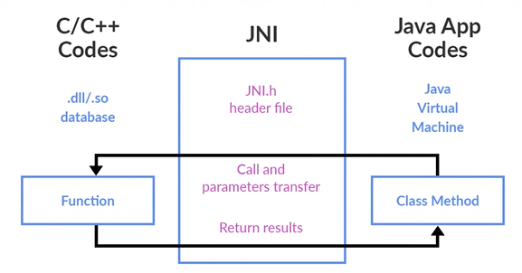

# Mincraft JNI Client
Este repositorio consiste em um estudo da criacao de uma '.dll' Windows para modificar as entradas no Minecraft. Um "cheat engine"

O codigo em si se baseia na injecao de DLLs no Minecraft usando a interface do JNI para chamar metodos e receber variaveis:

 

## Passo a Passo
O passo a passo do codigo e o entendimento de cada arquivo sera explicado durante este README. 

 

### Setup
Para o setup sera criado um projeto C++ com nome arbitrario e com a solucao e projeto no mesmo diretorio.
Em seguida, deve-se instalar o JDK-17 no seu computador, isso e necessario pois e a versao mais compativel com esse projeto.
No passo a passo da criacao do projeto:

 

- Cria-se um projeto vazio
- Nesse projeto vazio, ao ser criado, deleta-se as pastas criadas exceto a pasta `External Dependencies`
- Clica-se com o botao direto no arquivo principal do projeto e Adiciona-se um arquivo `main.cpp`
- Nas Propriedades do projeto, altera-se a versao do C++ para 17 Standard e o Configuration Type para `.dll`
- Altera-se na opcao do Linker:
	- No SubSistema, para Windows
	- Additional Dependencies para `$(CoreLibraryDependencies);%(AdditionalDependencies);jvm.lib`
	- Additional Library Dependencies para `$(SolutionDir)Dependencies\Lib;C:\Program Files\Java\jdk-17\lib`
- Altera-se na opcao do C/C++:
	- Compilacao Multi-processador para `Yes`
	- Additional Include Directory para `$(SolutionDir)Dependencies\Include;C:\Program Files\Java\jdk-17\include;C:\Program Files\Java\jdk-17\include\win32`
`C:\Program Files\Java\jdk-17\` e a pasta de instalacao do JDK-17
- Na pasta do projeto, adiciona-se uma nova pasta `Dependencies` e, dentro dela, `Include` e `Lib`.

Agora pode-se iniciar a escrita dos codigos.

 

A inspiracao eh baseada na serie de videos do canal aXXo [nesta playlist](https://youtube.com/playlist?list=PL36bJ4YMRalhyCwLMb3EOqK9oTvOeFdvY&si=IFT9V4XYxitEYgA1).